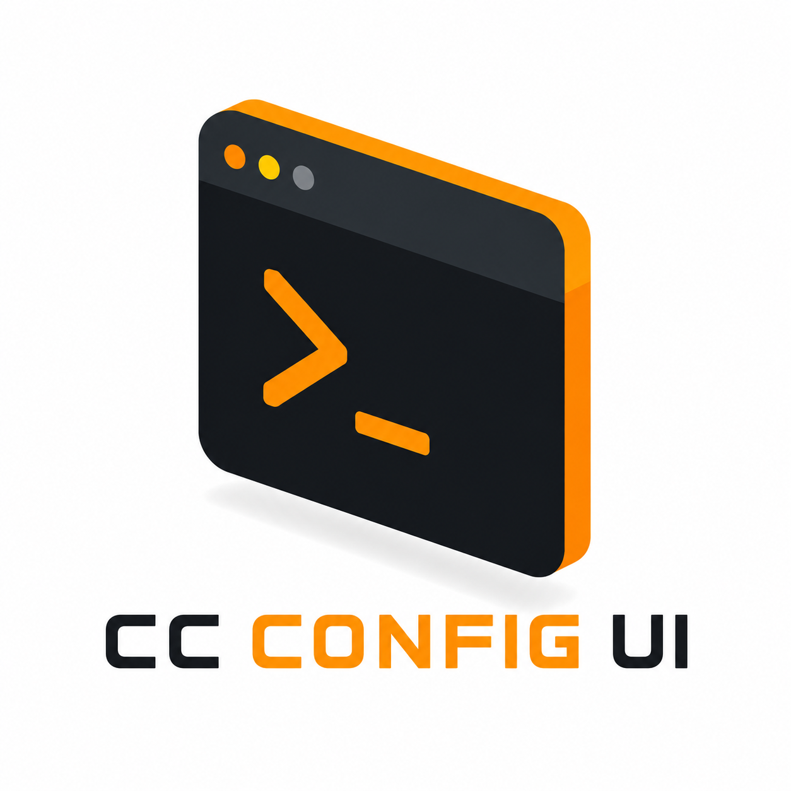

<p align="center">
  
</p>

<h1 align="center">CC CONFIG UI</h1>

<p align="center">
  一个轻量级、零依赖的 Web UI，用于管理你的
  <a href="https://docs.anthropic.com/en/docs/claude-code">Claude Code</a> 配置
</p>

<p align="center">
  <a href="README.md">English</a>
</p>

<p align="center">
  
  
  
  
</p>

---

## ✨ 这是什么

Claude Code 将所有配置——插件、会话、技能、设置——都存储在 `~/.claude/` 中。随着使用越来越频繁，这个目录会变得越来越复杂。**Claude Config Manager** 为你提供了一个简洁的 Web 界面来查看和管理所有内容。

**零依赖。** 一个 Python 文件 + 一个 HTML 文件，克隆即可运行。

## 🚀 快速开始

```bash
git clone https://github.com/YOUR_USERNAME/cc-config-ui.git
cd cc-config-ui
python server.py
```

然后在浏览器中打开 **http://127.0.0.1:8787**。

或者使用启动脚本：

| 平台 | 命令 |
|------|------|
| Windows | `start.bat` |
| macOS / Linux | `chmod +x start.sh && ./start.sh` |

## 📦 功能特性

| 功能 | 描述 |
|------|------|
| 📊 **仪表盘** | 概览统计、存储分布、最近活动、配置摘要 |
| 🧩 **插件管理** | 启用/禁用、查看 SKILL.md、卸载 — 按来源分组 |
| 💬 **会话管理** | 浏览对话、重命名会话、恢复到 CLI |
| ⚙️ **配置编辑** | 编辑 settings.json、CLAUDE.md、权限 — 在浏览器中 |
| 🔌 **MCP 服务器** | 查看、启用/禁用、删除所有插件中的 MCP 服务器 |
| ⭐ **技能浏览** | 已安装技能 + 市场浏览器，含安装状态 |
| 🧹 **清理工具** | 释放磁盘空间、在文件管理器中打开文件夹 |
| 📈 **系统信息** | 按模型统计 Token 用量、活跃热力图、每日统计 |
| 🌐 **国际化** | 完整的中英文支持，一键切换 |
| 🌙 **主题** | 暗色模式（默认）+ 亮色模式切换 |

## 🖥️ 使用方法

<details>
<summary><b>管理插件</b></summary>

1. 在侧边栏点击 **Plugins**
2. 使用顶部标签按来源筛选
3. 使用搜索框按名称搜索
4. 切换开关启用/禁用插件
5. 点击 **Detail** 查看 SKILL.md 文档
6. 点击 **Uninstall** 移除插件

</details>

<details>
<summary><b>查看会话</b></summary>

1. 在侧边栏点击 **Sessions**
2. 在左侧面板选择一个项目
3. 点击 **View** 阅读对话内容
4. 点击 **Rename**（铅笔图标）设置自定义标题
5. 点击 **Resume** 复制 `claude --resume` 命令
6. 点击 **Delete** 移除会话

</details>

<details>
<summary><b>管理 MCP 服务器</b></summary>

1. 在侧边栏点击 **MCP**
2. 查看所有插件中的 MCP 服务器
3. 切换开关启用/禁用服务器
4. 点击 **Detail** 查看原始配置
5. 点击 **Delete** 移除服务器

</details>

<details>
<summary><b>浏览技能市场</b></summary>

1. 在侧边栏点击 **Skills** → **Marketplace** 标签
2. 选择一个市场来源
3. 浏览可用技能（绿色标签 = 已安装）
4. 点击技能查看其 SKILL.md

</details>

<details>
<summary><b>清理存储</b></summary>

1. 在侧边栏点击 **Cleanup**
2. 勾选要清理的目录
3. 实时查看预计释放空间
4. 点击文件夹图标在文件管理器中打开目录
5. 点击 **Execute Cleanup** 删除内容

</details>

## 🏗️ 架构

```
┌──────────────────────┐       ┌──────────────────────┐
│                      │  API  │                      │
│    index.html        │◄─────►│    server.py         │
│    (单文件)          │ JSON  │    (零依赖)          │
│                      │       │                      │
│  • Tailwind CSS CDN  │       │  • Python 标准库     │
│  • 原生 JS           │       │  • http.server       │
│  • 国际化 (中/英)    │       │  • 原子写入          │
└──────────────────────┘       └───────────┬──────────┘
                                           │ 读写
                                           ▼
                                  ┌──────────────────────┐
                                  │     ~/.claude/       │
                                  │  settings.json       │
                                  │  plugins/cache/      │
                                  │  projects/           │
                                  │  skills/             │
                                  └──────────────────────┘
```

**设计原则：**
- 🔹 **零依赖** — 不需要 npm、pip 或构建步骤
- 🔹 **单文件架构** — 一个 HTML 文件，一个 Python 文件
- 🔹 **仅限本地** — 绑定 127.0.0.1，不对外暴露
- 🔹 **原子写入** — 临时文件 + 重命名，防止数据损坏

## 📡 API 参考

### 读取 (GET)

| 端点 | 描述 |
|------|------|
| `/api/dashboard` | 聚合概览统计 |
| `/api/plugins` | 按来源分组的插件列表 |
| `/api/plugins/:key` | 插件详情 (SKILL.md) |
| `/api/sessions` | 项目和会话列表（含标题） |
| `/api/sessions/:project/:id` | 会话对话内容 |
| `/api/skills` | 已安装技能列表 |
| `/api/skills/:name` | 技能详情 (SKILL.md) |
| `/api/mcp` | 所有 MCP 服务器 |
| `/api/mcp/:plugin/:server` | MCP 服务器配置 |
| `/api/marketplace/skills` | 市场技能浏览器 |
| `/api/settings` | settings.json |
| `/api/claude-md` | CLAUDE.md |
| `/api/history` | 会话历史 |
| `/api/stats` | 使用统计 |
| `/api/storage` | 存储空间分布 |

### 写入 (PUT/POST/DELETE)

| 方法 | 端点 | 描述 |
|------|------|------|
| PUT | `/api/settings` | 写入 settings.json |
| PUT | `/api/claude-md` | 写入 CLAUDE.md |
| POST | `/api/plugins/toggle` | 启用/禁用插件 |
| POST | `/api/mcp/toggle` | 启用/禁用 MCP |
| POST | `/api/sessions/rename` | 重命名会话 |
| POST | `/api/cleanup/execute` | 执行清理 |
| POST | `/api/open-folder` | 在文件管理器中打开文件夹 |
| DELETE | `/api/plugins/:key` | 卸载插件 |
| DELETE | `/api/sessions/:project/:id` | 删除会话 |
| DELETE | `/api/skills/:name` | 删除技能 |
| DELETE | `/api/mcp/:plugin/:server` | 删除 MCP 服务器 |

## 📁 项目结构

```
├── server.py            # 后端 REST API (~1100 行)
├── index.html           # 前端 UI (~1400 行)
├── logo.png             # 项目 Logo
├── start.bat            # Windows 启动脚本
├── start.sh             # macOS/Linux 启动脚本
├── README.md            # 英文文档
└── README_CN.md         # 中文文档（本文件）
```

## 🔒 安全

- 服务器仅绑定到 **本地回环地址**（`127.0.0.1`）
- API 密钥字段使用密码输入遮罩
- 路径穿越防护（所有路径验证在 `~/.claude/` 内）
- 原子文件写入防止数据损坏
- 删除操作需要确认

## 🤝 参与贡献

欢迎贡献代码！

1. **Fork** 本仓库
2. **创建** 功能分支（`git checkout -b feature/amazing-feature`）
3. **提交** 更改（`git commit -m 'Add amazing feature'`）
4. **推送** 到分支（`git push origin feature/amazing-feature`）
5. **发起** Pull Request

## 📄 许可证

本项目基于 [MIT 许可证](LICENSE) 发布。

---

<p align="center">
  Built with ❤️ for the <a href="https://docs.anthropic.com/en/docs/claude-code">Claude Code</a> community
</p>
